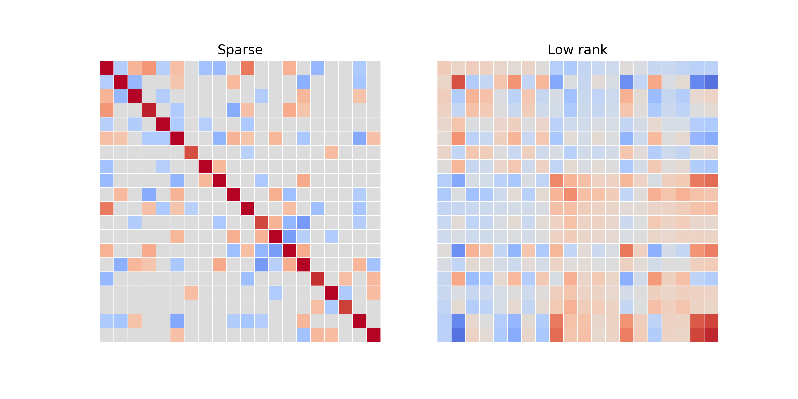
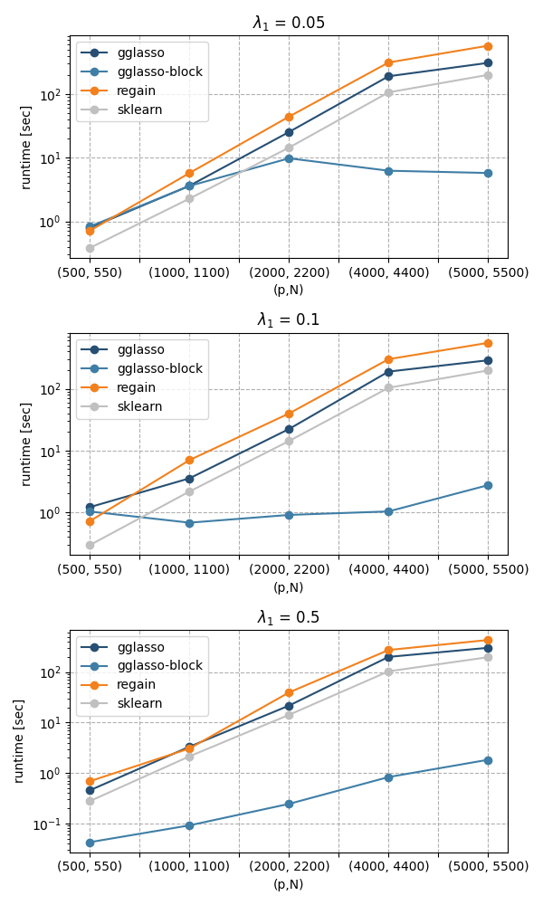

# Summary

We introduce `GGLasso`, a Python package that solves General Graphical Lasso problems. The Graphical Lasso scheme, introduced by [@Friedman2007],[@Yuan2007], and [@Banerjee2008], estimates a sparse inverse covariance matrix $\Theta$ from multivariate Gaussian data $\mathcal{X} \sim \mathcal{N}(\mu, \Sigma) \in \mathbb{R}^p$. Originally proposed by [@Dempster:1972] under the name Covariance Selection, this estimation framework has been extended to include latent variables in [@Chandrasekaran2012]. Recent extensions also include the joint estimation of multiple inverse covariance matrices, see, e.g., in [@Danaher2013; @Tomasi2018]. The `GGLasso` package contains methods for solving the general problem formulation:

$$
\min_{\Theta, L \in \mathbb{S}_{++}^K }\quad \sum_{k=1}^{K} \left(-\log\det(\Theta^{(k)} - L^{(k)}) + \langle S^{(k)},  \Theta^{(k)} - L^{(k)} \rangle \right)+ \mathcal{P}(\Theta) +\sum_{k=1}^{K} \mu_{1,k} \|L^{(k)}\|_{\star}.
\label{eq:problem}
$$

Here, we denote with $\mathbb{S}_{++}^K$ the $K$-product of the space of symmetric, positive definite matrices. Moreover, we write $\Theta = (\Theta^{(1)},\dots,\Theta^{(K)})$ for the sparse component of the inverse covariances and $L = (L^{(1)},\dots,L^{(K)})$ for the low rank components, formed by potential latent variables. Typically, $\mathcal{P}$ is a regularization function, inducing a desired sparsity structure. The above problem formulation includes many important special cases, such as, the single (latent) Graphical Lasso, the Group, and the Fused Graphical Lasso.

# Statement of need 

Currently, there is no Python package for solving Group Graphical Lasso problems. The Single Graphical Lasso problem is implemented in `scikit-learn` [@Pedregosa2011], however with no extension for latent variables. The package `regain` [@Tomasi2018] contains solvers for Single and Fused Graphical Lasso problems, with and without latent variables. With `GGLasso`, we make the following contributions:

- Proposing a uniform framework for solving Graphical Lasso problems. 
- Providing solvers for Group Graphical Lasso problems (with and without latent variables).
- Providing a solver for -- what we call -- *nonconforming GGL* problems where not all variables are contained in every instance. We demonstrate a usecase of such a formulation in the context of microbial consensus networks. 
- Implementing a block-wise ADMM solver for SGL problems following [@Witten2011] as well as proximal point solvers for FGL and GGL problems [@Zhang2019; @Zhang2020].

In the table below we give an overview of existing functionalities and the `GGLasso` package.


|       | scikit-learn |  regain |  GGLasso | comment |
| ----------- | ----------- | ----------- | ----------- | ----------- |
| SGL              | **yes**    | **yes**       | **yes**       | new: block-wise solver           |
| SGL + latent     | **no**       | **yes**       | **yes**       |             |
| GGL              | **no**       | **no**          | **yes**       |             |
| GGL + latent     | **no**       | **no**          | **yes**       |             |
| FGL              | **no**       | **yes**       | **yes**       | new: proximal point solver            |
| FGL + latent     | **no**       | **yes**       | **yes**       |             |
| GGL nonconforming  (+latent)    | **no**       | **no**       | **yes**       |             |


# Functionalities

## Installation and problem initiation

`GGLasso` can be easily installed via `pip`.

```shell
pip install gglasso
```

The central object of `GGLasso` is the class `glasso_problem`, which streamlines the solving or model selection procedure for SGL, GGL, FGL problems with or without latent variables.

As an example, we instantiate a Single Graphical Lasso problem (see the problem formulation below). We input the empirical covariance matrix `S` and the number of samples `N`. We can choose to model latent variables and set the regularization parameters via the other input arguments.

```python
# Import the main class of the package
from gglasso.problem import glasso_problem

# Define a SGL problem instance with given data S 
problem  = glasso_problem(S, N, reg = None, 
                          reg_params = {'lambda1': 0.01}, latent = False)
```

As a second example, we instantiate a Group Graphical Lasso problem with latent variables. Typically, the optimal choice of the regularization parameters are not known and are determined via model selection.

```python
# Define a GGL problem instance with given data S 
problem  = glasso_problem(S, N, reg = "GGL", reg_params = None, latent = True)
```

According to the input arguments, `glasso_problem` has two main methods:

- if the regularization parameters are already specified, call the correct solver,
- else, find the best regularization parameters and the respective solution via model selection (typically done with grid search and the eBIC criterion [@Foygel2010]).

```python
problem.solve()
problem.model_selection()
```

For further information on the input arguments and methods, we refer to the [detailled documentation](https://gglasso.readthedocs.io/en/latest/problem-object.html).

## Problem formulation

We list important special cases of general problem formulation described in the summary \autoref{eq:problem}. For a mathematical formulation for each special case, we refer to the [documentation](https://gglasso.readthedocs.io/en/latest/math-description.html).


### *SGL* Single Graphical Lasso: {#SGL} 
For $K=1$, the problem reduces to the Single (latent variable) Graphical Lasso where 
$$
\mathcal{P}(\Theta) = \lambda_1 \sum_{i \neq j} |\Theta_{ij}|.
$$

### *GGL* Group Graphical Lasso: {#GGL}
For 
$$
\mathcal{P}(\Theta) = \lambda_1 \sum_{k=1}^{K} \sum_{i \neq j} |\Theta_{ij}^{(k)}| + \lambda_2  \sum_{i \neq j} \left(\sum_{k=1}^{K} |\Theta_{ij}^{(k)}|^2 \right)^{\frac{1}{2}}
$$
we obtain the Group Graphical Lasso as formulated in [@Danaher2013].

### *FGL* Fused Graphical Lasso: {#FGL}
For
$$
\mathcal{P}(\Theta) = \lambda_1 \sum_{k=1}^{K} \sum_{i \neq j} |\Theta_{ij}^{(k)}| + \lambda_2  \sum_{k=2}^{K}   \sum_{i \neq j} |\Theta_{ij}^{(k)} - \Theta_{ij}^{(k-1)}|
$$
we obtain Fused (also called Time-Varying) Graphical Lasso [@Danaher2013; @Tomasi2018; @Hallac2017].

### Nonconforming GGL:

Consider the GGL case in a situation where not each variable is observed in each of the instances $k=1,\dots,K$. `GGLasso` is able to solve these problems and include latent variables. We provide the mathematical details in the [documentation](https://gglasso.readthedocs.io/en/latest/math-description.html#ggl-the-nonconforming-case) and give an [example](https://gglasso.readthedocs.io/en/latest/auto_examples/plot_nonconforming_ggl.html#sphx-glr-auto-examples-plot-nonconforming-ggl-py).





## Optimization algorithms

The `GGLasso` package implements several methods with provable convergence guarantees for solving the optimization problems formulated above. 

- *ADMM*: for all problem formulations we implemented the ADMM algorithm [@Boyd2011]. ADMM is a flexible and efficient optimization scheme which is specifically suited for Graphical Lasso problems as it only relies on efficient computation of the proximal operators of the involved functions [@Danaher2013; @Tomasi2018; @Ma2013].  

- *PPDNA*: for GGL and FGL problems without latent variables, we included the proximal point solver proposed in [@Zhang2019; @Zhang2020]. According to the numerical experiments in [@Zhang2020], PPDNA can be an efficient alternative to ADMM especially for fast local convergence.

- *block-ADMM*: for SGL problems without latent variables, we implemented a method which solves the problem blockwise, following the proposal in [@Witten2011]. This wrapper simply applies the ADMM solver to all connected components of the empirical covariance matrix after thresholding.

## Benchmarks and applications

In our example gallery, we included benchmarks comparing the solvers in `GGLasso` to state-of-the-art software as well as illustrative examples explaining the usage and functionalities of the package. We want to emphasize the following examples:

- [Benchmarks](https://gglasso.readthedocs.io/en/latest/auto_examples/plot_benchmarks.html#sphx-glr-auto-examples-plot-benchmarks-py) for SGL problems: our solver is competitive with `scikit-learn` and `regain`. The newly implemented block-wise solver is highly efficient for large, sparse networks.




- [Soil microbiome application](https://gglasso.readthedocs.io/en/latest/auto_examples/plot_soil_example.html#sphx-glr-auto-examples-plot-soil-example-py): we demonstrate how latent variables can be used in order to reconstruct unobserved confounders of the independence network.

- [Nonconforming GGL](https://gglasso.readthedocs.io/en/latest/auto_examples/plot_nonconforming_ggl.html#sphx-glr-auto-examples-plot-nonconforming-ggl-py): we illustrate how to use `GGLasso` for GGL problems with missing variables. 


# Acknowledgements
 

# References


